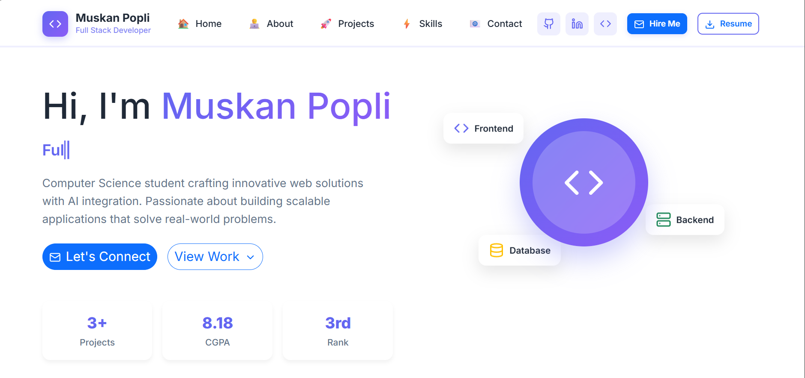
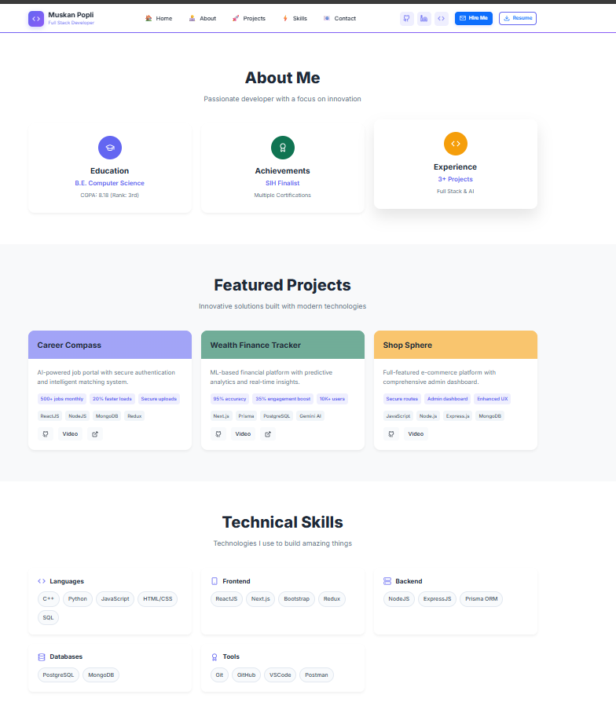

# 🌐 Muskan Popli - Developer Portfolio

Welcome to my personal portfolio!  
A modern, responsive, and elegant website showcasing my projects, skills, and professional journey in full stack development and AI integration.

🔗 **Live Preview**: [https://muskanpopli.github.io/Portfolio](https://portfolio-nine-woad-78.vercel.app/)  
📁 **GitHub Repository**: [https://github.com/Muskanpopli/Portfolio](https://github.com/Muskanpopli/Portfolio)

---
## 🚀 Tech Stack

This portfolio is built using modern web technologies:

- **Frontend**: React, Next.js, Tailwind CSS
- **Backend (showcased projects)**: Node.js, Express.js, Prisma ORM
- **Databases**: PostgreSQL, MongoDB
- **Tools**: Git, GitHub, VS Code, Postman

---

## 📸 Screenshots

### 🖥️ Home Page


### 📄 About, Projects & Skills


---

---

## 🧩 Sections

- **Hero** – Introduction with title, CTA buttons, and animated stack tags.
- **About Me** – Education, achievements, and experience.
- **Featured Projects** – Showcasing real-world apps with stack tags and links.
- **Technical Skills** – Categorized tech stack.
- **Contact** – Easy contact via LinkedIn or email.
- **Responsive Design** – Works beautifully on mobile and desktop.

---

## 🏗️ Installation & Local Setup

```bash
# Clone the repository
git clone https://github.com/Muskanpopli/Portfolio.git

# Navigate to the project folder
cd Portfolio

# Install dependencies
npm install

# Run the development server
npm run dev

# Open in browser
http://localhost:3000
